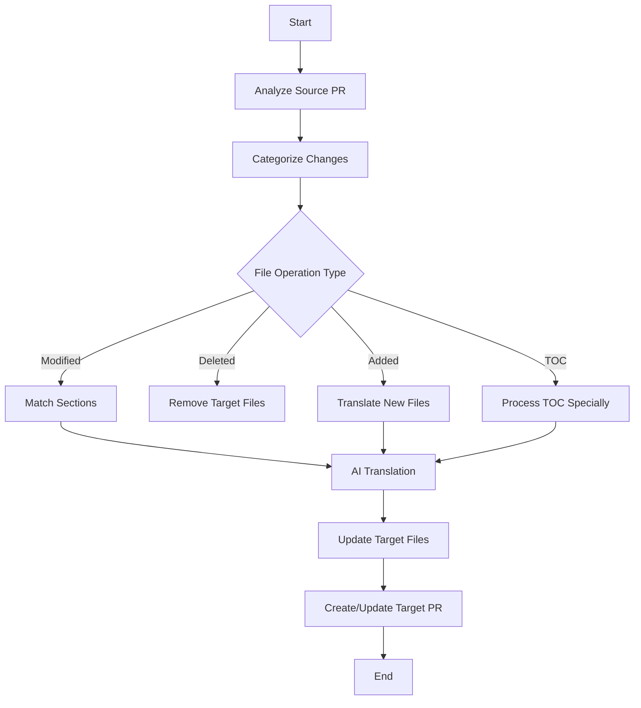

# AI PR Translator

An intelligent documentation translator that automatically synchronizes documentation updates made in a pull request from the source language to the target language using AI-powered alignment and translation. Ideal for maintaining consistent, up-to-date multilingual documentation across folders or repositories.

## Why use this tool?

### Cost savings

- **Translates only what changed**: Instead of re-translating entire documents, the tool identifies and translates only the modified sections, drastically reducing API costs
- **Token-efficient processing**: Smart section matching minimizes redundant AI calls
- **Configurable limits**: Set token budgets to control spending

### Translation consistency

- **Context-aware translation**: Provides AI with existing translations as reference, ensuring consistent terminology and style across updates
- **Preserves established translations**: Reuses proven translations for unchanged content
- **Maintains voice and tone**: Keeps your documentation's character consistent over time

### Safety and precision

- **Non-destructive updates**: Only modifies sections that actually changed in the source PR
- **Preserves untouched content**: Sections not mentioned in the source diff remain completely unchanged in the target
- **Section-level granularity**: Surgical precision in applying updates, avoiding accidental overwrites

### Comparison: Traditional vs Smart Translation

| Approach | Cost per Update | Consistency | Risk of Breaking Unchanged Content |
|----------|----------------|-------------|-------------------------------------|
| **Full Document Re-translation** | 💸💸💸 High (entire doc) | ⚠️ May vary | ⚠️ High - everything gets rewritten |
| **Manual Section Translation** | 💰 Medium (time-intensive) | ✅ Good if careful | ⚠️ Medium - human error |
| **This Tool (Smart Incremental)** | 💚 Low (only changes) | ✅ Excellent | ✅ Minimal - surgical updates |

## Features

### Core capabilities

- **🔄 Automated PR Synchronization**: Analyzes source PR changes and applies translated updates to target repository
- **🤖 AI-Powered Translation**: Supports multiple AI providers (DeepSeek, Gemini) for high-quality technical translation
- **📄 Smart File Operations**: Handles added, deleted, and modified files intelligently
- **🎯 Section-Level Matching**: Advanced algorithms match source and target document sections with high accuracy
- **🔧 GitHub Actions Ready**: Designed to run seamlessly in CI/CD workflows

### Intelligent processing

- **Direct Matching**: Exact matching for identical section hierarchies
- **AI Fuzzy Matching**: Handles restructured or renamed sections using AI
- **System Variable Recognition**: Automatically identifies configuration items and system variables
- **Special File Handling**: Custom logic for TOC files and configuration documents
- **Batch Processing**: Efficient handling of large documentation files

## Prerequisites

- Python 3.7+
- GitHub Personal Access Token with repo access
- API keys for your chosen AI provider (DeepSeek or Gemini)

## Installation

1. Clone the repository:

    ```bash
    git clone https://github.com/yourusername/ai-pr-translator.git
    cd ai-pr-translator
    ```

2. Install dependencies:

    ```bash
    cd scripts
    pip install -r requirements.txt
    ```

## Configuration

### Environment variables

Set the following environment variables:

```bash
# Required
export SOURCE_PR_URL="https://github.com/owner/repo/pull/123"
export TARGET_PR_URL="https://github.com/owner/repo-cn/pull/456"
export GITHUB_TOKEN="your_github_token"
export TARGET_REPO_PATH="/path/to/target/repo"

# AI Provider (choose one)
export AI_PROVIDER="deepseek"  # or "gemini"
export DEEPSEEK_API_TOKEN="your_deepseek_token"  # if using DeepSeek
# OR
export GEMINI_API_TOKEN="your_gemini_token"  # if using Gemini

# Optional: Token limits
export MAX_NON_SYSTEM_SECTIONS_FOR_AI=120
export SOURCE_TOKEN_LIMIT=5000
export AI_MAX_TOKENS=20000
```

## Usage

### Basic usage

```bash
cd scripts
python main_workflow.py
```

### GitHub actions

Create a workflow file (`.github/workflows/sync-docs.yml`):

```yaml
name: Sync Documentation
on:
  pull_request:
    types: [opened, synchronize]
    paths:
      - '**.md'

jobs:
  sync:
    runs-on: ubuntu-latest
    steps:
      - uses: actions/checkout@v3
      
      - name: Setup Python
        uses: actions/setup-python@v4
        with:
          python-version: '3.9'
      
      - name: Install dependencies
        run: |
          cd scripts
          pip install -r requirements.txt
      
      - name: Run sync
        env:
          SOURCE_PR_URL: ${{ github.event.pull_request.html_url }}
          TARGET_PR_URL: ${{ secrets.TARGET_PR_URL }}
          GITHUB_TOKEN: ${{ secrets.GITHUB_TOKEN }}
          DEEPSEEK_API_TOKEN: ${{ secrets.DEEPSEEK_API_TOKEN }}
          TARGET_REPO_PATH: ${{ github.workspace }}
          AI_PROVIDER: deepseek
        run: |
          cd scripts
          python main_workflow.py
```

## Architecture

### Module Overview

```text
scripts/
├── main_workflow.py      # Main orchestration and workflow entry point
├── pr_analyzer.py        # PR analysis, diff parsing, hierarchy building
├── section_matcher.py    # Section matching (direct + AI fuzzy matching)
├── file_adder.py         # New file processing and translation
├── file_deleter.py       # Deleted file processing
├── file_updater.py       # Modified section processing and translation
├── toc_processor.py      # Special TOC file handling
└── __init__.py           # Package initialization
```

### Workflow



### Processing Pipeline

1. **PR Analysis** (`pr_analyzer.py`)
   - Fetches PR diff from GitHub to identify **only what changed**
   - Parses markdown files and builds document hierarchy
   - Categorizes changes by operation type (added/modified/deleted)
   - Extracts section content and metadata
   - **Benefit**: Eliminates unnecessary translation of unchanged content

2. **Section Matching** (`section_matcher.py`)
   - Direct matching for identical hierarchies
   - AI-powered matching for restructured sections
   - System variable detection and exact matching
   - Confidence scoring for match quality
   - **Benefit**: Precisely identifies which target sections need updates, protecting untouched content

3. **AI Translation** (`file_updater.py`, `file_adder.py`)
   - Generates contextual prompts with source diff **AND existing target translations**
   - Provides AI with reference translations for consistency
   - Calls AI provider API (DeepSeek or Gemini)
   - Token usage tracking and optimization
   - Batch processing for large files
   - **Benefit**: AI learns from existing translations, ensuring terminology consistency and reducing costs

4. **Target Update** (`file_updater.py`)
   - Applies translated content **only to matched sections**
   - Preserves formatting and structure
   - Handles line-level updates for modified sections
   - Leaves unmatched sections completely untouched
   - Creates new files or removes deleted ones
   - **Benefit**: Non-destructive updates with surgical precision

## Advanced features

### Token limit management

Control costs by setting limits:

```python
MAX_NON_SYSTEM_SECTIONS_FOR_AI = 120  # Max sections per file
SOURCE_TOKEN_LIMIT = 5000              # Max tokens for source content
AI_MAX_TOKENS = 20000                  # Max tokens per AI request
```

### Special file configuration

Customize handling for specific files:

```python
SPECIAL_FILES = ["TOC.md"]  # Files requiring special processing
IGNORE_FILES = [             # Files to skip
    "faq/ddl-faq.md",
    "command-line-flags-for-tidb-configuration.md"
]
```

### Section matching strategies

1. **Direct Matching**: Exact hierarchy and title matching
2. **Normalized Matching**: Title normalization for minor variations
3. **AI Fuzzy Matching**: LLM-powered matching for complex restructures
4. **System Variable Matching**: Special rules for configuration items

## Output

The tool generates debug files in `temp_output/`:

```text
temp_output/
├── {file}-source-diff-dict.json           # Source changes
├── {file}-match_source_diff_to_target.json # Section matching results
├── {file}-ai-prompt.txt                    # AI translation prompts
└── {file}-ai-response.txt                  # AI translation responses
```

## Use cases

### Cost-effective documentation maintenance

A typical scenario: Your 1000-line documentation has a 5-line change. Traditional translation would cost tokens for all 1000 lines. This tool? Only the 5 lines + surrounding context, **saving 95%+ of translation costs**.

### Consistent terminology across updates

When updating technical documentation, the tool provides AI with your existing translations. If you previously translated "同步" as "replicate" in English, the AI will maintain that term instead of using variations like "synchronize", ensuring consistency.

### Real-world applications

- **Documentation Internationalization**: Maintain English and Chinese versions of technical docs with incremental updates
- **Cross-Repository Sync**: Keep documentation in sync across multiple repos without re-translating unchanged content
- **Translation Quality Assurance**: Review only the changed sections before merging, not entire documents
- **Large-Scale Documentation**: Handle repositories with thousands of markdown files efficiently by translating only PR changes

## License

This project is licensed under the MIT License - see the [LICENSE](LICENSE) file for details.
