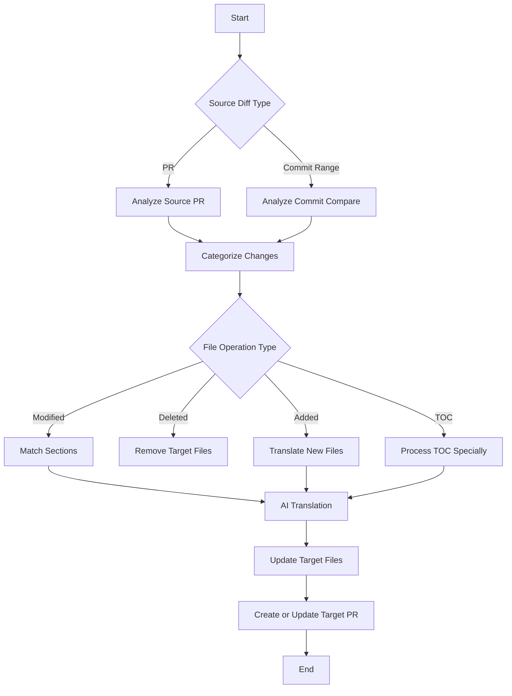

# AI PR Translator

An intelligent documentation translator that automatically synchronizes incremental documentation updates from a source language repository to a target language repository using AI-powered alignment and translation. It supports both pull request diff sync and commit diff sync, making it suitable for contributor-driven PR updates as well as scheduled translation workflows.

## Why use this tool?

### Cost savings

- **Translates only what changed**: Instead of re-translating entire documents, the tool identifies and translates only the modified sections, drastically reducing API costs
- **Token-efficient processing**: Smart section matching minimizes redundant AI calls
- **Configurable limits**: Set token budgets to control spending

### Translation consistency

- **Context-aware translation**: Provides AI with existing translations as reference, ensuring consistent terminology and style across updates
- **Glossary-aware translation**: Loads a project glossary (e.g. `terms.md`) and automatically matches only the terms that appear in the current document, feeding them to the AI for accurate, consistent terminology — without bloating the prompt with the entire glossary
- **Preserves established translations**: Reuses proven translations for unchanged content
- **Maintains voice and tone**: Keeps your documentation's character consistent over time

### Safety and precision

- **Non-destructive updates**: Only modifies sections that actually changed in the source diff
- **Preserves untouched content**: Sections not mentioned in the source diff remain completely unchanged in the target
- **Section-level granularity**: Surgical precision in applying updates, avoiding accidental overwrites

### Comparison: Traditional vs Smart Translation

| Approach | Cost per Update | Consistency | Risk of Breaking Unchanged Content |
|----------|----------------|-------------|-------------------------------------|
| **Full Document Re-translation** | 💸💸💸 High (entire doc) | ⚠️ May vary | ⚠️ High - everything gets rewritten |
| **Manual Section Translation** | 💰 Medium (time-intensive) | ✅ Good if careful | ⚠️ Medium - human error |
| **This Tool (Smart Incremental)** | 💚 Low (only changes) | ✅ Excellent | ✅ Minimal - surgical updates |

## Features

### Core capabilities

- **🔄 Automated PR Synchronization**: Analyzes source PR changes and applies translated updates to target repository
- **🕒 Commit-Based Incremental Sync**: Analyzes source commit ranges and creates target-language updates from `base_ref -> head_ref` diffs
- **🤖 AI-Powered Translation**: Supports multiple AI providers (DeepSeek, Gemini) for high-quality technical translation
- **📄 Smart File Operations**: Handles added, deleted, and modified files intelligently
- **🎯 Section-Level Matching**: Advanced algorithms match source and target document sections with high accuracy
- **🔧 GitHub Actions Ready**: Designed to run seamlessly in CI/CD workflows

### Intelligent processing

- **Direct Matching**: Exact matching for identical section hierarchies
- **AI Fuzzy Matching**: Handles restructured or renamed sections using AI
- **Glossary Filtering**: Matches only the relevant glossary terms for each document, keeping prompts lean and costs low
- **System Variable Recognition**: Automatically identifies configuration items and system variables
- **Special File Handling**: Custom logic for TOC files and configuration documents
- **Batch Processing**: Efficient handling of large documentation files

## Prerequisites

- Python 3.9+
- GitHub Personal Access Token with repo access
- API credentials for your chosen provider (DeepSeek, Gemini, OpenAI, or Azure OpenAI)

## Installation

1. Clone the repository:

    ```bash
    git clone https://github.com/yourusername/ai-pr-translator.git
    cd ai-pr-translator
    ```

2. Install dependencies:

    ```bash
    cd scripts
    pip install -r requirements.txt
    ```

## Configuration

### Environment variables

Set the variables for the mode you want to run.

#### PR mode (`main_workflow.py`)

```bash
# Required
export SOURCE_PR_URL="https://github.com/owner/repo/pull/123"
# Or limit PR mode to a new source commit range after a previous translation:
# export SOURCE_PR_URL="https://github.com/owner/repo/pull/123/files/<base>..<head>"
export TARGET_PR_URL="https://github.com/owner/repo-cn/pull/456"
export GITHUB_TOKEN="your_github_token"
export TARGET_REPO_PATH="/path/to/target/repo"

# AI Provider (choose one)
export AI_PROVIDER="deepseek"  # deepseek, gemini, openai, or azure
export DEEPSEEK_API_TOKEN="your_deepseek_token"  # if using DeepSeek
# OR
export GEMINI_API_TOKEN="your_gemini_token"  # if using Gemini
# OR
export OPENAI_API_TOKEN="your_openai_token"  # if using OpenAI
# OR
export AZURE_OPENAI_KEY="your_azure_openai_key"
export OPENAI_BASE_URL="https://your-resource.openai.azure.com/openai/v1/"

# Optional: Glossary for consistent term translation
export TERMS_PATH="/path/to/terms.md"  # auto-detected from TARGET_REPO_PATH if not set

# Optional: Token limits
export MAX_NON_SYSTEM_SECTIONS_FOR_AI=120
export SOURCE_TOKEN_LIMIT=50000
export DEEPSEEK_MAX_OUTPUT_TOKENS=8192
export GEMINI_MAX_OUTPUT_TOKENS=8192
export OPENAI_MAX_OUTPUT_TOKENS=32768
export AZURE_MAX_OUTPUT_TOKENS=65536

# Optional: limit PR analysis to explicit source files
export SOURCE_FILES="docs/guide.md,docs/faq.md"

# Optional: File-level parallelism
export DIFF_PARALLEL_FILE_THRESHOLD=6  # parallelize when changed file count is greater than this
export DIFF_PARALLEL_WORKERS=4
```

When `SOURCE_FILES` is set in PR mode, the workflow narrows analysis to those files before diff inspection, then keeps the downstream file filter as a second guard. When `SOURCE_PR_URL` is a PR files commit-range URL, PR mode still uses the PR translation flow and prompts, but analyzes only the `<base>..<head>` source diff.

#### Commit-based mode (`commit_sync_workflow.py`)

```bash
# Required
export SOURCE_REPO="owner/repo"
export TARGET_REPO="owner/repo-cn"
export GITHUB_TOKEN="your_github_token"
export TARGET_REPO_PATH="/path/to/target/repo"
export SOURCE_BASE_REF="abc123"
export SOURCE_HEAD_REF="def456"

# Optional: source branch label for logs / workflow context
export SOURCE_BRANCH="main"

# Optional: set by GitHub Actions as GITHUB_EVENT_NAME. Use "workflow_dispatch"
# for manual runs or "schedule" for scheduled runs to enable per-file
# Corresponding EN commit cursor handling. Caller workflows should only advance
# latest_translation_commit.json for scheduled runs, not workflow_dispatch runs.
export COMMIT_SYNC_RUN_TYPE="schedule"

# Optional: limit sync scope to a folder or explicit files
export SOURCE_FOLDER="ai"
export SOURCE_FILES="ai/foo.md,ai/bar.md"

# Optional: only applies when SOURCE_FILES is set.
# Use "incremental" for commit-diff translation, or "full" to translate each
# selected file as a complete file using the source content at SOURCE_HEAD_REF.
export SOURCE_FILES_TRANSLATION_MODE="incremental"

# AI Provider and glossary
export AI_PROVIDER="deepseek"  # deepseek, gemini, openai, or azure
export TERMS_PATH="/path/to/terms.md"
```

`commit_sync_workflow.py` uses the explicit `SOURCE_BASE_REF -> SOURCE_HEAD_REF` compare range passed in by the caller. For scheduled commit-based runs, target files that contain `<!--Corresponding EN commit: ...-->` and do not match `SOURCE_BASE_REF` are translated separately from that per-file commit to `SOURCE_HEAD_REF`. Manual runs add or update this marker on fully translated Markdown files; scheduled runs remove existing markers from fully translated Markdown files so those files return to the global cursor. Partial output is intentionally preserved and can be pushed, but its per-file cursor is not advanced. At the end of a scheduled run, the script atomically updates the global SHA and stores incomplete files with their original source refs in the `pending` object in `latest_translation_commit.json`, so later runs retry the missed range. An unexpected process failure occurs before this atomic finalization, and the caller workflow must refuse to advance or push that run.

The example workflows currently follow the `main` branch of `qiancai/ai-pr-translator`, so translator updates are picked up automatically. This is an intentional convenience tradeoff: changes to `main` take effect without a separate workflow configuration update.

## Usage

### PR mode

```bash
cd scripts
python main_workflow.py
```

### Commit-based mode

```bash
cd scripts
python commit_sync_workflow.py
```

For local verification with explicit source commits, you can also edit `scripts/commit_sync_workflow_local.py` and set `SOURCE_BASE_REF` / `SOURCE_HEAD_REF` directly before running:

```bash
cd scripts
python commit_sync_workflow_local.py
```

### GitHub actions

#### PR-based sync

Create a workflow file (`.github/workflows/sync-docs.yml`):

```yaml
name: Sync Documentation
on:
  pull_request:
    types: [opened, synchronize]
    paths:
      - '**.md'

jobs:
  sync:
    runs-on: ubuntu-latest
    steps:
      - uses: actions/checkout@df4cb1c069e1874edd31b4311f1884172cec0e10 # v6
      
      - name: Setup Python
        uses: actions/setup-python@ece7cb06caefa5fff74198d8649806c4678c61a1 # v6
        with:
          python-version: '3.9'
      
      - name: Install dependencies
        run: |
          cd scripts
          pip install -r requirements.txt
      
      - name: Run sync
        env:
          SOURCE_PR_URL: ${{ github.event.pull_request.html_url }}
          TARGET_PR_URL: ${{ secrets.TARGET_PR_URL }}
          GITHUB_TOKEN: ${{ secrets.GITHUB_TOKEN }}
          DEEPSEEK_API_TOKEN: ${{ secrets.DEEPSEEK_API_TOKEN }}
          TARGET_REPO_PATH: ${{ github.workspace }}
          AI_PROVIDER: deepseek
        run: |
          cd scripts
          python main_workflow.py
```

#### Scheduled commit-based sync

Use `commit_sync_workflow.py` when you want another workflow to compute a source commit range and pass it in explicitly, for example after reading a cursor file such as `latest_translation_commit.json` in the target repository and comparing it to the current source branch HEAD.

## Architecture

### Module Overview

```text
scripts/
├── main_workflow.py      # PR-based orchestration entry point
├── commit_sync_workflow.py # Commit-based orchestration entry point for scheduled sync
├── diff_analyzer.py      # Shared diff analysis for PR and commit workflows
├── section_matcher.py    # Section matching (direct + AI fuzzy matching)
├── glossary.py           # Glossary loading, term matching, and prompt formatting
├── file_adder.py         # New file processing and translation
├── file_deleter.py       # Deleted file processing
├── file_updater.py       # Modified section processing and translation
├── toc_processor.py      # Special TOC file handling
└── __init__.py           # Package initialization
```

### Workflow


```mermaid
graph TD
    A[Start] --> B{"Source Diff Type"}
    B -->|PR| C[Analyze Source PR]
    B -->|Commit Range| D[Analyze Commit Compare]
    C --> E[Categorize Changes]
    D --> E
    E --> F{File Operation Type}
    F -->|Added| G[Translate New Files]
    F -->|Deleted| H[Remove Target Files]
    F -->|Modified| I[Match Sections]
    F -->|TOC| J[Process TOC Specially]
    I --> K[AI Translation]
    G --> K
    J --> K
    K --> L[Update Target Files]
    L --> M[Create or Update Target PR]
    M --> N[End]
```

### Processing Pipeline

1. **Diff Analysis** (`diff_analyzer.py`)
   - Fetches a PR diff or a commit compare from GitHub to identify **only what changed**
   - Parses markdown files and builds document hierarchy
   - Categorizes changes by operation type (added/modified/deleted)
   - Extracts section content and metadata
   - **Benefit**: Eliminates unnecessary translation of unchanged content

   In commit-based mode, `commit_sync_workflow.py` consumes the explicit compare range it is given. If you use a cursor file such as `latest_translation_commit.json`, that file should be managed by the caller workflow (for example in the target repository). Scheduled runs can temporarily override that global cursor for files that carry a `Corresponding EN commit` marker.

2. **Section Matching** (`section_matcher.py`)
   - Direct matching for identical hierarchies
   - AI-powered matching for restructured sections
   - System variable detection and exact matching
   - Confidence scoring for match quality
   - **Benefit**: Precisely identifies which target sections need updates, protecting untouched content

3. **AI Translation** (`file_updater.py`, `file_adder.py`)
   - Generates contextual prompts with source diff **AND existing target translations**
   - Provides AI with reference translations for consistency
   - Calls AI provider API (DeepSeek or Gemini)
   - Token usage tracking and optimization
   - Batch processing for large files
   - **Benefit**: AI learns from existing translations, ensuring terminology consistency and reducing costs

4. **Target Update** (`file_updater.py`)
   - Applies translated content **only to matched sections**
   - Preserves formatting and structure
   - Handles line-level updates for modified sections
   - Leaves unmatched sections completely untouched
   - Creates new files or removes deleted ones
   - **Benefit**: Non-destructive updates with surgical precision

## Advanced features

### Token limit management

Control work size and provider-specific output budgets with environment variables:

```bash
export MAX_NON_SYSTEM_SECTIONS_FOR_AI=120 # Max non-system sections per file
export SOURCE_TOKEN_LIMIT=50000            # Source diff limit for regular modified files
export DEEPSEEK_MAX_OUTPUT_TOKENS=8192
export GEMINI_MAX_OUTPUT_TOKENS=8192
export OPENAI_MAX_OUTPUT_TOKENS=32768
export AZURE_MAX_OUTPUT_TOKENS=65536
```

Each output budget is clamped to the provider ceiling built into the client. `SOURCE_TOKEN_LIMIT` applies to the regular modified-file translation path; special-file processors have their own batching behavior.

### Special file configuration

Customize handling for specific files and folders in `scripts/workflow_ignore_config.json`:

```json
{
  "PR_MODE_IGNORE_FILES": [
    "TOC-tidb-cloud.md",
    "TOC-ai.md"
  ],
  "PR_MODE_IGNORE_FOLDERS": [
    "tidb-cloud",
    "ai"
  ],
  "COMMIT_BASED_MODE_IGNORE_FILES": [],
  "COMMIT_BASED_MODE_IGNORE_FOLDERS": []
}
```

Set `VERBOSE_WORKFLOW_LOGS=true` to print full AI prompts, AI responses, and
per-section update details when you need deep debugging. It is disabled by
default to keep GitHub Actions logs compact.

### Section matching strategies

1. **Direct Matching**: Exact hierarchy and title matching
2. **Normalized Matching**: Title normalization for minor variations
3. **AI Fuzzy Matching**: LLM-powered matching for complex restructures
4. **System Variable Matching**: Special rules for configuration items

## Output

The tool generates debug files in `temp_output/`:

```text
temp_output/
├── {file}-source-diff-dict.json           # Source changes
├── {file}-match_source_diff_to_target.json # Section matching results
├── {file}-ai-prompt.txt                    # AI translation prompts
└── {file}-ai-response.txt                  # AI translation responses
```

## Use cases

### Cost-effective documentation maintenance

A typical scenario: Your 1000-line documentation has a 5-line change. Traditional translation would cost tokens for all 1000 lines. This tool? Only the 5 lines + surrounding context, **saving 95%+ of translation costs**.

### Consistent terminology across updates

When updating technical documentation, the tool provides AI with your existing translations. If you previously translated "同步" as "replicate" in English, the AI will maintain that term instead of using variations like "synchronize", ensuring consistency.

### Real-world applications

- **Documentation Internationalization**: Maintain English and Chinese versions of technical docs with incremental updates
- **Cross-Repository Sync**: Keep documentation in sync across multiple repos without re-translating unchanged content
- **Translation Quality Assurance**: Review only the changed sections before merging, not entire documents
- **Large-Scale Documentation**: Handle repositories with thousands of markdown files efficiently by translating only incremental PR or commit changes
- **Scheduled Folder Sync**: Periodically translate directories such as `docs/ai` from the source repo and automatically open a target-language PR

## License

This project is licensed under the MIT License - see the [LICENSE](LICENSE) file for details.
