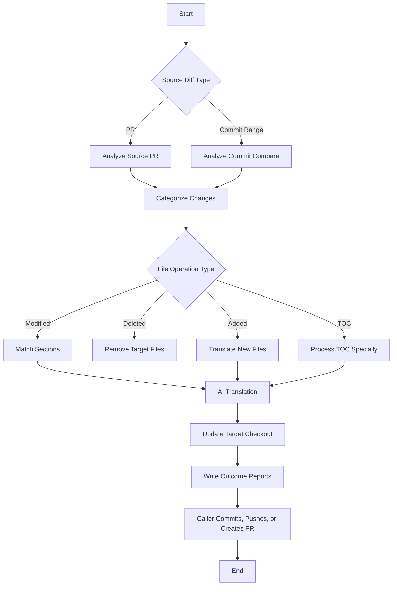

# AI Markdown Translator

An intelligent documentation translator that automatically synchronizes incremental Markdown documentation updates from a source language repository to a target language repository using AI-powered alignment and translation. It supports both pull request diff sync and commit diff sync, making it suitable for contributor-driven PR updates as well as scheduled translation workflows.

## Why use this tool?

### Cost savings

- **Translates only what changed**: Instead of re-translating entire documents, the tool identifies and translates only the modified sections, drastically reducing API costs
- **Token-efficient processing**: Smart section matching minimizes redundant AI calls
- **Configurable limits**: Set work-size and provider-specific output limits to control spending

### Translation consistency

- **Context-aware translation**: Provides AI with existing translations as reference, ensuring consistent terminology and style across updates
- **Glossary-aware translation**: Loads a project glossary (e.g. `terms.md`) and automatically matches only the terms that appear in the current document, feeding them to the AI for accurate, consistent terminology — without bloating the prompt with the entire glossary
- **Preserves established translations**: Reuses proven translations for unchanged content
- **Maintains voice and tone**: Keeps your documentation's character consistent over time

### Safety and precision

- **Non-destructive updates**: Only modifies sections that actually changed in the source diff
- **Preserves untouched content**: Sections not mentioned in the source diff remain completely unchanged in the target
- **Section-level granularity**: Surgical precision in applying updates, avoiding accidental overwrites

### Comparison: Traditional vs Smart Translation

| Approach | Cost per Update | Consistency | Risk of Breaking Unchanged Content |
|----------|----------------|-------------|-------------------------------------|
| **Full Document Re-translation** | 💸💸💸 High (entire doc) | ⚠️ May vary | ⚠️ High - everything gets rewritten |
| **Manual Section Translation** | 💰 Medium (time-intensive) | ✅ Good if careful | ⚠️ Medium - human error |
| **This Tool (Smart Incremental)** | 💚 Low (only changes) | ✅ Excellent | ✅ Minimal - surgical updates |

## Use cases

### Incremental Markdown documentation updates without translation drift

When a large document receives a small source update, translate only the affected lines within the affected sections instead of regenerating the entire target document. The translator uses the surrounding section and the existing target translation as context, so even line-level changes remain context-aware and accurate. Untouched lines and sections keep their existing wording, formatting, links, and manually refined translations, which reduces token usage and prevents unrelated content from changing between releases. Readers therefore get a more consistent experience while reviewers can focus on the actual update.

### Terminology-controlled product documentation

Use a configurable `terms.md` glossary to define preferred translations for product names, technical concepts, and domain-specific language. The tool selects only terms relevant to the current document and combines them with existing target translations as context, helping new content follow the same terminology and writing style without sending the entire glossary on every request.

### PR translation that stays easy to review

For contributor-driven documentation changes, synchronize a source PR or a selected commit range into an existing target-language PR. The resulting diff stays close to the source change, making linguistic and technical review easier. If some files fail or receive incomplete AI responses, useful translations from other files are retained and the remaining work is listed in a failure report.

### Scheduled synchronization at repository scale

For repositories with many Markdown files, run commit-based synchronization on a schedule or limit a manual run to selected folders and files. The cursor and pending-file mechanism tracks incomplete work across runs, allowing successful translations to move forward while failed files remain visible and retryable instead of blocking every other update.

## Features

### Core capabilities

- **🔄 Automated PR Synchronization**: Analyzes source PR changes and applies translated updates to target repository
- **🕒 Commit-Based Incremental Sync**: Analyzes source commit ranges and creates target-language updates from `base_ref -> head_ref` diffs
- **🤖 AI-Powered Translation**: Supports DeepSeek, Gemini, OpenAI, and Azure OpenAI
- **📄 Smart File Operations**: Handles added, deleted, and modified files intelligently
- **🎯 Section-Level Matching**: Advanced algorithms match source and target document sections with high accuracy
- **🔧 GitHub Actions Ready**: Designed to run seamlessly in CI/CD workflows

### Intelligent processing

- **Direct Matching**: Exact matching for identical section hierarchies
- **AI Fuzzy Matching**: Handles restructured or renamed sections using AI
- **Glossary Filtering**: Matches only the relevant glossary terms for each document, keeping prompts lean and costs low
- **System Variable Recognition**: Automatically identifies configuration items and system variables
- **Special File Handling**: Custom logic for TOC files and configuration documents
- **Batch Processing**: Efficient handling of large documentation files

## Prerequisites

- Python 3.9+
- GitHub token with read access to the source repository and write access to the target checkout/PR branch
- API credentials for your chosen provider (DeepSeek, Gemini, OpenAI, or Azure OpenAI)

## Installation

1. Clone the repository:

    ```bash
    git clone https://github.com/qiancai/ai-markdown-translator.git
    cd ai-markdown-translator
    ```

2. Install dependencies:

    ```bash
    python3 -m venv .venv
    source .venv/bin/activate
    python -m pip install -r scripts/requirements.txt
    ```

The dependency file uses exact versions so local runs and GitHub Actions use the same tested package set. Use a virtual environment to avoid changing packages in an existing Python environment.

## Configuration

### Environment variables

Set the variables for the mode you want to run.

#### PR mode (`main_workflow.py`)

```bash
# Required
export SOURCE_PR_URL="https://github.com/owner/repo/pull/123"
# Or limit PR mode to a new source commit range after a previous translation:
# export SOURCE_PR_URL="https://github.com/owner/repo/pull/123/files/<base>..<head>"
export TARGET_PR_URL="https://github.com/owner/repo-cn/pull/456"
export GITHUB_TOKEN="your_github_token"
export TARGET_REPO_PATH="/path/to/target/repo"

# AI Provider (choose one)
export AI_PROVIDER="deepseek"  # deepseek, gemini, openai, or azure
export DEEPSEEK_API_TOKEN="your_deepseek_token"  # if using DeepSeek
# OR
export GEMINI_API_TOKEN="your_gemini_token"  # if using Gemini
# OR
export OPENAI_API_TOKEN="your_openai_token"  # if using OpenAI
# OR
export AZURE_OPENAI_KEY="your_azure_openai_key"
export OPENAI_BASE_URL="https://your-resource.openai.azure.com/openai/v1/"

# Optional: override the provider's default model
export DEEPSEEK_MODEL_NAME="deepseek-chat"
export GEMINI_MODEL_NAME="gemini-3-flash-preview"
export OPENAI_MODEL_NAME="gpt-4.1"
export AZURE_OPENAI_MODEL_NAME="gpt-5.4"

# Optional: Glossary for consistent term translation
export TERMS_PATH="/path/to/terms.md"  # auto-detected from TARGET_REPO_PATH if not set

# Optional: Token limits
export MAX_NON_SYSTEM_SECTIONS_FOR_AI=120
export SOURCE_TOKEN_LIMIT=50000
export DEEPSEEK_MAX_OUTPUT_TOKENS=8192
export GEMINI_MAX_OUTPUT_TOKENS=8192
export OPENAI_MAX_OUTPUT_TOKENS=32768
export AZURE_MAX_OUTPUT_TOKENS=65536

# Optional: limit PR analysis to explicit source files
export SOURCE_FILES="docs/guide.md,docs/faq.md"

# Optional: File-level parallelism
export DIFF_PARALLEL_FILE_THRESHOLD=6  # parallelize when changed file count is greater than this
export DIFF_PARALLEL_WORKERS=4

# Optional: leave local changes unstaged (useful for local review)
export SKIP_GIT_ADD=true
```

When `SOURCE_FILES` is set in PR mode, the workflow narrows analysis to those files before diff inspection, then keeps the downstream file filter as a second guard. When `SOURCE_PR_URL` is a PR files commit-range URL, PR mode still uses the PR translation flow and prompts, but analyzes only the `<base>..<head>` source diff.

#### Commit-based mode (`commit_sync_workflow.py`)

```bash
# Required
export SOURCE_REPO="owner/repo"
export TARGET_REPO="owner/repo-cn"
export GITHUB_TOKEN="your_github_token"
export TARGET_REPO_PATH="/path/to/target/repo"
export SOURCE_BASE_REF="abc123"
export SOURCE_HEAD_REF="def456"

# Optional: source branch label for logs / workflow context
export SOURCE_BRANCH="main"

# Optional: use local source/target checkouts instead of GitHub content reads
export SOURCE_REPO_PATH="/path/to/source/repo"
export TARGET_REF="target-branch"
export PREFER_LOCAL_TARGET_FOR_READ=true

# Optional: set by GitHub Actions as GITHUB_EVENT_NAME. Use "workflow_dispatch"
# for manual runs or "schedule" for scheduled runs to enable per-file
# Corresponding EN commit cursor handling. Caller workflows should only advance
# latest_translation_commit.json for scheduled runs, not workflow_dispatch runs.
export COMMIT_SYNC_RUN_TYPE="schedule"

# Optional: limit sync scope to a folder or explicit files
export SOURCE_FOLDER="ai"
export SOURCE_FILES="ai/foo.md,ai/bar.md"

# Optional: only applies when SOURCE_FILES is set.
# Use "incremental" for commit-diff translation, or "full" to translate each
# selected file as a complete file using the source content at SOURCE_HEAD_REF.
export SOURCE_FILES_TRANSLATION_MODE="incremental"

# AI Provider and glossary
export AI_PROVIDER="deepseek"  # deepseek, gemini, openai, or azure
export TERMS_PATH="/path/to/terms.md"

# Optional: return a non-zero exit status when any file completely fails
export FAIL_ON_TRANSLATION_ERROR=true
```

`commit_sync_workflow.py` uses the explicit `SOURCE_BASE_REF -> SOURCE_HEAD_REF` compare range passed in by the caller. For scheduled commit-based runs, target files that contain `<!--Corresponding EN commit: ...-->` and do not match `SOURCE_BASE_REF` are translated separately from that per-file commit to `SOURCE_HEAD_REF`. Manual runs add or update this marker on fully translated Markdown files; scheduled runs remove existing markers from fully translated Markdown files so those files return to the global cursor. Partial output is intentionally preserved and can be pushed, but its per-file cursor is not advanced. At the end of a scheduled run, the script atomically updates the global SHA and stores incomplete files with their original source refs in the `pending` object in `latest_translation_commit.json`, so later runs retry the missed range. If the process fails before atomic finalization, the caller workflow must refuse to advance the cursor or push that run.

Both Python entry points modify the target checkout and stage successful changes by default. They do not create commits, push branches, post comments, or create pull requests; those operations belong to the caller workflow. Set `SKIP_GIT_ADD=true` when you want to inspect unstaged changes locally.

The example workflows currently follow the `main` branch of `qiancai/ai-markdown-translator`, so translator updates are picked up automatically. This is an intentional convenience tradeoff: changes to `main` take effect without a separate workflow configuration update.

## Usage

### PR mode

```bash
cd scripts
python main_workflow.py
```

### Commit-based mode

```bash
cd scripts
python commit_sync_workflow.py
```

### Translation verification

Compare a source commit range with a translated pull request and write an Excel report:

```bash
export GITHUB_TOKEN="your_github_token"
python scripts/verify_translation.py \
  --source-compare "https://github.com/owner/repo/compare/base...head" \
  --target-pr "https://github.com/owner/repo/pull/123"
```

For PR-based source changes, pass `--source-pr` instead of `--source-compare`. Use `--source-repo-path` with a local checkout to avoid the GitHub compare API file limit. Run `python scripts/verify_translation.py --help` for all options.

### GitHub actions

#### PR-based sync

Use [`sync-doc-pr-zh-to-en.yml`](sync-doc-pr-zh-to-en.yml) as the complete template. Copy it to `.github/workflows/` in the repository from which you want to run the automation. It is manually triggered and accepts `source_pr_url`, `target_pr_url`, and `ai_provider`. Unlike a minimal script invocation, the template resolves and clones the target PR head repository and branch, runs the translator, pushes successful output, and posts the failure report to the target PR.

Configure `GITHUB_TOKEN` and the secret for each provider you expose in the workflow: `AZURE_OPENAI_KEY` plus `AZURE_OPENAI_BASE_URL`, `DEEPSEEK_API_TOKEN`, or `GEMINI_API_TOKEN`. The Python client also supports direct OpenAI, but the bundled workflow does not currently expose `openai` as a choice; add the choice and pass `OPENAI_API_TOKEN` if your copy needs it.

#### Scheduled commit-based sync

Use [`sync-doc-updates-zh-to-en.yml`](sync-doc-updates-zh-to-en.yml) as the scheduled/manual commit-sync template. Customize its repository, branch, language, glossary, and provider settings before copying it into `.github/workflows/`. The bundled template currently uses Azure OpenAI and follows `qiancai/ai-markdown-translator@main`.

The target branch must already contain a cursor file like this:

```json
{
  "target": "main",
  "sha": "<last-successfully-finalized-source-commit>",
  "pending": {}
}
```

`target` must match `SOURCE_BRANCH`. Scheduled runs update `sha` and `pending` atomically. Manual runs can translate explicit `file_names` in `incremental` or `full` mode without advancing the global cursor.

## Architecture

### Module Overview

```text
scripts/
├── main_workflow.py        # PR-based orchestration entry point
├── commit_sync_workflow.py # Commit-based orchestration entry point for scheduled sync
├── ai_client.py            # DeepSeek, Gemini, OpenAI, and Azure client adapter
├── diff_analyzer.py        # Shared PR and commit-range diff analysis
├── section_matcher.py      # Direct and AI-assisted section matching
├── glossary.py             # Glossary loading, filtering, and prompt formatting
├── file_adder.py           # New-file translation
├── file_deleter.py         # Deleted-file processing
├── file_updater.py         # Incremental section translation and update
├── image_processor.py      # Added, modified, and deleted image handling
├── toc_processor.py        # Special TOC handling
├── index_file_processor.py # Special index-file handling
├── file_io.py              # Safe path resolution and atomic file writes
└── workflow_outcome.py     # Partial/failure tracking and reports
```

### Workflow


```mermaid
graph TD
    A[Start] --> B{"Source Diff Type"}
    B -->|PR| C[Analyze Source PR]
    B -->|Commit Range| D[Analyze Commit Compare]
    C --> E[Categorize Changes]
    D --> E
    E --> F{File Operation Type}
    F -->|Added| G[Translate New Files]
    F -->|Deleted| H[Remove Target Files]
    F -->|Modified| I[Match Sections]
    F -->|TOC| J[Process TOC Specially]
    I --> K[AI Translation]
    G --> K
    J --> K
    K --> L[Update Target Checkout]
    L --> M[Write Outcome Reports]
    M --> N[Caller Commits, Pushes, or Creates PR]
    N --> O[End]
```

### Processing Pipeline

1. **Diff Analysis** (`diff_analyzer.py`)
   - Fetches a PR diff or a commit compare from GitHub to identify **only what changed**
   - Parses markdown files and builds document hierarchy
   - Categorizes changes by operation type (added/modified/deleted)
   - Extracts section content and metadata
   - **Benefit**: Eliminates unnecessary translation of unchanged content

   In commit-based mode, `commit_sync_workflow.py` consumes the explicit compare range it is given. If you use a cursor file such as `latest_translation_commit.json`, that file should be managed by the caller workflow (for example in the target repository). Scheduled runs can temporarily override that global cursor for files that carry a `Corresponding EN commit` marker.

2. **Section Matching** (`section_matcher.py`)
   - Direct matching for identical hierarchies
   - AI-powered matching for restructured sections
   - System variable detection and exact matching
   - Confidence scoring for match quality
   - **Benefit**: Precisely identifies which target sections need updates, protecting untouched content

3. **AI Translation** (`file_updater.py`, `file_adder.py`)
   - Generates contextual prompts with source diff **AND existing target translations**
   - Provides AI with reference translations for consistency
   - Calls the selected AI provider (DeepSeek, Gemini, OpenAI, or Azure OpenAI)
   - Token usage tracking and optimization
   - Batch processing for large files
   - **Benefit**: AI learns from existing translations, ensuring terminology consistency and reducing costs

4. **Target Update** (`file_updater.py`)
   - Applies translated content **only to matched sections**
   - Preserves formatting and structure
   - Handles line-level updates for modified sections
   - Leaves unmatched sections completely untouched
   - Creates new files or removes deleted ones
   - **Benefit**: Non-destructive updates with surgical precision

## Advanced features

### Token limit management

Control work size and provider-specific output budgets with environment variables:

```bash
export MAX_NON_SYSTEM_SECTIONS_FOR_AI=120 # Max non-system sections per file
export SOURCE_TOKEN_LIMIT=50000            # Source diff limit for regular modified files
export DEEPSEEK_MAX_OUTPUT_TOKENS=8192
export GEMINI_MAX_OUTPUT_TOKENS=8192
export OPENAI_MAX_OUTPUT_TOKENS=32768
export AZURE_MAX_OUTPUT_TOKENS=65536
```

Each output budget is clamped to the provider ceiling built into the client. `SOURCE_TOKEN_LIMIT` applies to the regular modified-file translation path; special-file processors have their own batching behavior.

### Special file configuration

Customize handling for specific files and folders in `scripts/workflow_ignore_config.json`:

```json
{
  "PR_MODE_IGNORE_FILES": [
    "TOC-tidb-cloud.md",
    "TOC-ai.md"
  ],
  "PR_MODE_IGNORE_FOLDERS": [
    "tidb-cloud",
    "ai"
  ],
  "COMMIT_BASED_MODE_IGNORE_FILES": [],
  "COMMIT_BASED_MODE_IGNORE_FOLDERS": []
}
```

`VERBOSE_WORKFLOW_LOGS` currently defaults to `true`, which prints full mapping responses and detailed translation diagnostics. Set it to `false` in GitHub Actions when compact logs are preferred.

### Section matching strategies

1. **Direct Matching**: Exact hierarchy and title matching
2. **Normalized Matching**: Title normalization for minor variations
3. **AI Fuzzy Matching**: LLM-powered matching for complex restructures
4. **System Variable Matching**: Special rules for configuration items

## Output

Each run recreates `scripts/temp_output/` and writes diagnostic and outcome files as applicable:

```text
scripts/temp_output/
├── {file}-source-diff-dict.json                     # Parsed source changes
├── {file}-match_source_diff_to_target.json          # Section matches
├── {file}_prompt-for-ai-translation[.part-NNN].txt  # Translation prompts
├── {file}_updated_sections_from_ai[.part-NNN].json  # Parsed AI output
├── translation-failures.md                          # Human-readable follow-up report
├── translation-failures.json                        # Machine-readable partial/failure report
└── translation-structure-errors.json                # Structure mismatches, when present
```

Partial translations are deliberately retained. Successfully translated files can therefore be committed and pushed even when other files fail; incomplete, failed, or structurally mismatched files are listed in the outcome reports for manual review or retry.

## License

This project is licensed under the MIT License - see the [LICENSE](LICENSE) file for details.
